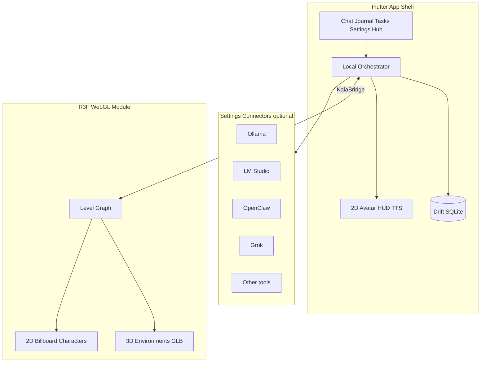
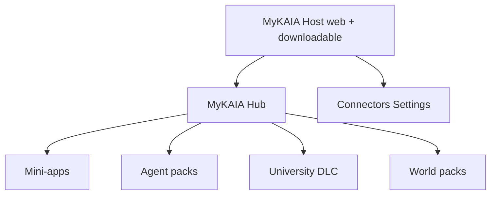

# MyKAIA — Product Plan

**Keep At It, Always**

| | |
|--|--|
| **Version** | 2026.7.27.0.00.01 |
| **Date** | 2026-07-27 |
| **Domain** | [mykaia.app](https://mykaia.app) |
| **Status** | Approved planning baseline (implementation not started) |

© Mycelia Interactive. MyKAIA and “Keep At It, Always” are trademarks of Mycelia Interactive.

---

## 1. Vision and positioning

**MyKAIA** is a local-first, cross-platform **neurodivergent multitool** with a living companion (KAIA) and an optional game layer (levels, XP, 3D environments, 2D characters).

It is **not** marketed only as a productivity app or only as a game. It contains both:

- Companion tools — chat, journal, notepad, tasks/time, routines, reminders, learning (KAIA University), creative writing, NPC creation, automations
- Game layer — hubs/levels, non-punitive XP, artifacts, 3D stages with 2D billboard characters
- Platform layer — web + downloadable clients + **MyKAIA Hub** (in-product mini-app / pack marketplace)

Audience: tailored for neurodivergent users; designed so everyone can use and customize the experience.

---

## 2. Brand and IP

| Element | Locked value |
|---------|----------------|
| **Brand** | **MyKAIA** |
| **Tagline** | **Keep At It, Always** |
| **Trademark** | MyKAIA / “Keep At It, Always” — protect on product, web, and store surfaces |
| **Copyright** | **Mycelia Interactive** (About, legal, docs, installers, web footers, pack manifests) |
| **Domain** | [mykaia.app](https://mykaia.app) — purchased and paid 2026-07-27 (Dynadot) |
| **Companion character** | **KAIA** (in-product live agent); brand umbrella remains MyKAIA |
| **Marketplace** | **MyKAIA Hub** (not “Ecosystem” in consumer copy) |
| **Legal line** | © Mycelia Interactive. MyKAIA and “Keep At It, Always” are trademarks of Mycelia Interactive. |

Public naming: lead with **MyKAIA**; keep the tagline visible; use “multitool” only as description, not the brand name.

---

## 3. Neurodivergent UX principles

- Full-spectrum neurodivergent UX (not ADHD-only)
- Every accessibility / cognitive / sensory control is toggleable in **Settings** and customizable in **Onboarding**
- Defaults are gentle; never forced
- Capture-before-organize
- Non-punitive progression (XP never decreases; no streak shame)
- Sensory escape hatch from world / intensity
- **Live Audio Listen** is an explicit opt-in (onboarding + settings)
- **Simple Mode** can hide the game layer entirely

Example controls to ship: light/sound/motion intensity, reduced flash, reduced animation, focus chrome, RSD-safe copy preferences, text-first vs voice-first defaults.

---

## 4. Locked stack and rationale

### Application shell — Flutter (stable) + Dart 3.x

Owns: Windows / macOS / Linux / iOS / Android (+ web), chat, journal, tasks, settings, Drift/SQLite, TTS HUD avatar, connectors, Module Focus Mode, onboarding.

Suggested modules: Riverpod, go_router, Drift/SQLite, WebView host for the world.

### World / game — React Three Fiber + Three.js (WebGL)

Owns: 3D environments, levels, cameras, lights, triggers, collectibles, progression spaces.

Stack: React 19, Vite, TypeScript, `@react-three/fiber`, `@react-three/drei`, Three.js.

### Characters — 2D in 3D

KAIA and NPCs are **camera-facing 2D billboards** (spritesheets) inside the 3D scene, plus a Flutter HUD avatar for chat/TTS. Full 3D character rigs are deferred.

### Bridge

Flutter WebView ↔ R3F via JS channel `KaiaBridge`. Flutter/SQLite is source of truth.

### Why this split

| Rejected as whole-app engine | Why |
|------------------------------|-----|
| Unreal | Overkill; weak 2D story; heavy mobile cost |
| Unity / Godot as sole host | Strong for games; poor fit for settings/connectors/OS productivity chrome |
| Tauri-only | Strong desktop prototype; fails hard “including mobile” |

Flutter already proven in-portfolio (`mycelia_studio`). R3F gives modern WebGL without forcing the entire product into a game engine.

---

## 5. System architecture



### Integration pattern

1. Build world as Vite + React 19 + R3F static package
2. Bundle into Flutter assets or load from app documents for large packs
3. Embed via full-screen World WebView route
4. Bidirectional bridge: Flutter `runJavaScript` / postMessage; R3F `JavascriptChannel`

Do not run R3F inside Dart. Do not rebuild productivity UI in React.

### Bridge design rules

- Source of truth: Flutter / Drift SQLite (XP, unlocks, quests, NPC defs, journal, tasks)
- World is view + interaction surface
- JSON text payloads only on `KaiaBridge`
- Simple Mode: do not mount World WebView; bridge idle

### Envelope

```json
{
  "v": 1,
  "id": "uuid",
  "ts": "ISO-8601",
  "dir": "app_to_world | world_to_app",
  "type": "event.type.name",
  "payload": {},
  "ack_of": null
}
```

Unknown `type` → `bridge.nack` with `code: unknown_type` (do not crash).

### Lifecycle events

| Type | Dir | Notes |
|------|-----|-------|
| `bridge.hello` | world→app | World ready |
| `bridge.hello_ack` | app→world | Protocol confirm |
| `world.request_snapshot` | world→app | After reconnect |
| `world.snapshot` | app→world | Full authoritative state |
| `bridge.ack` / `bridge.nack` | either | Mutating command results |
| `bridge.ping` / `bridge.pong` | either | Health |

### Snapshot (boot state)

Includes: `simple_mode`, `xp`, `level`, `rapport`, `mood`, `current_hub`, `current_level`, `unlocks`, `artifacts`, `npcs[]`, `quests_active`, `settings_visual`.

World applies snapshot idempotently.

### App → World (selected)

Progression: `world.set_xp`, `world.set_level`, `world.unlock_area`, `world.grant_artifact`  
Nav: `world.load_hub`, `world.load_level`, `world.travel_to`, `world.pause`  
NPC: `world.spawn_npc`, `world.focus_npc`, `world.set_npc_state`, `world.kaia_speak_viseme`, `world.kaia_speak_end`  
Prefs: `world.set_rapport`, `world.set_mood`, `world.set_simple_mode`, `world.set_visual_prefs`  
Quests: `world.quest_offer`, `world.quest_update`, `world.quest_clear`

### World → App (selected)

Presence: `app.level_entered`, `app.level_exited`, `app.portal_used`  
Open surfaces: `app.open_chat`, `app.open_journal`, `app.open_task`, `app.open_timed_focus`, `app.enter_module_focus`, `app.exit_module_focus`, `app.open_npc_studio`, `app.open_university`, `app.open_settings`, `app.quick_capture`  
Progression requests: `app.collect_artifact`, `app.quest_objective_hit`, `app.quest_complete`, `app.xp_request`, `app.unlock_request`  
NPC: `app.npc_interact`, `app.kaia_prompt`  
Safety: `app.escape_hatch`, `app.performance_degrade`, `app.world_error`

### Ack / failure rules

1. Mutating world commands ack/nack within 2s or one retry with same `id`
2. XP and unlocks are app-authoritative (world requests; app confirms)
3. Duplicate `id` ignored for 60s
4. Reconnect = hello → full snapshot (no delta sync in v1)
5. Simple Mode mid-flight: set flag then unmount WebView
6. Honor `reduced_flash` / motion prefs

### ID conventions

`hub_*`, `level_##_*`, `area_*`, `artifact_*`, `quest_*`, `objective_*`, `npc_*` (`kaia` reserved), `spawn_*`

### Minimal v1 event set

Lifecycle: `bridge.hello`, `bridge.hello_ack`, `world.snapshot`, `world.request_snapshot`  
Nav: `world.load_hub`, `world.load_level`, `app.level_entered`, `app.level_exited`  
Progression: `world.set_xp`, `world.unlock_area`, `app.xp_request`, `app.collect_artifact`  
NPC: `world.spawn_npc`, `world.set_npc_state`, `app.npc_interact`, `app.open_chat`  
Safety: `app.escape_hatch`, `world.set_visual_prefs`, `world.set_simple_mode`

---

## 6. Feature modules

### Flutter modules

- Chat / KAIA live companion
- NPC Studio (hours-long creation loop)
- Journal (locked) + open Notepad
- Tasks / Time sessions
- Routines / Automations / Reminders
- KAIA University
- Create (novel/screenplay — phased)
- Design scratchpad (phased)
- World host (WebView)
- Progression (XP, levels, artifacts)
- Settings (ND UX, Voice, Connectors, Focus Mode keybindings)
- Onboarding
- Per-module Focus Mode via shared scaffold

### Module Focus Mode (every module)

Every module ships its own distraction-free **Focus Mode**.

| Property | Spec |
|----------|------|
| Layout | Fullscreen / immersive; zero chrome from other modules |
| Shrink/close | Exit returns to shell without destroying module state |
| Distinct from | Timed Focus Session tools (pomodoro-style) |
| Default corner | **Top-right** |
| Exit copy | “Click here to exit Focus Mode” |
| Initial visibility | Visible **10 seconds** on enter |
| Then | Invisible; hit zone remains |
| Reveal | Mouse-over / pointer-enter **or** tap/click in zone |
| Re-hide | **10 seconds** after reveal |
| Keyboard | Shortcut exits even when chrome invisible |
| Customize | Settings → Keybindings / Focus (`focus_mode.exit_shortcut`, corner, timers) |

Implementation: shared `ModuleFocusScaffold`; minimum ~44dp hit target; no aggressive pulsing; World Focus Mode uses same Flutter overlay.

Settings keys: `focus_mode.exit_shortcut`, `focus_mode.exit_corner` (`top_right`), `focus_mode.chrome_visible_ms` (`10000`), `focus_mode.reveal_hide_ms` (`10000`).

---

## 7. Game design

### Mechanics

- Discrete hubs/levels (not an open MMO)
- Non-punitive XP and artifacts (XP never decreases)
- Soft optional quests; hideable via Simple Mode
- World triggers open Flutter tools (journal kiosk, task board, talk-to-KAIA)
- Rapport float affects ambient mood/lighting only

### 3D assets

| Include in v1 | Defer |
|---------------|--------|
| Environment GLBs | Full 3D character meshes/rigs |
| Props / interactables / artifacts | Photoreal / MetaHuman pipelines |
| Lighting/fog/sky presets | Massive open-world streaming |
| Collision/trigger metadata | |
| 2D spritesheets for KAIA + user NPCs | |

Pipeline: Blender → optimized GLB (Draco/meshopt) → world pack manifest → R3F loaders. Art direction: **2D cast on a 3D stage**.

### First three levels

#### `hub_home` (always unlocked)

Safe home hub. GLB `world/hub_home/hub_home.glb`, spawn `spawn_arrival_dock`, KAIA at `spawn_kaia_lily`. Journal kiosk, task board, chat stone, portal row. Artifact `artifact_starter_lily`. Optional quest `quest_welcome_breath`. Portal to `level_01_pond` available after first launch / onboarding path.

#### `level_01_pond`

Unlock: onboarding complete (no XP gate). Spawn `spawn_shore`. Teach bridge interactions + capture/focus lanterns. Areas: shore, bridge, reed path. Artifact `artifact_pond_pebble`. Quest `quest_first_shore`. Completing quest **or** XP level-2 threshold unlocks `level_02_records_antechamber`.

#### `level_02_records_antechamber`

Records Cavern antechamber (reward space for consistency). Unlock via Level 1 quest or XP gate. Pedestal gallery, University alcove, locked door to future Level 3. Artifact `artifact_records_seal`. Quest `quest_place_pebble`.

### Unlock wiring (app-authoritative)

```text
hub_home                     → always
level_01_pond                → onboarding complete
level_02_records_antechamber → quest_first_shore OR xp >= L2 threshold
```

### World pack manifest (draft)

```json
{
  "pack_id": "kaia_world_v1",
  "levels": [
    {
      "level_id": "hub_home",
      "glb": "hub_home/hub_home.glb",
      "spawn_id": "spawn_arrival_dock",
      "always_unlocked": true
    },
    {
      "level_id": "level_01_pond",
      "glb": "level_01_pond/level_01_pond.glb",
      "spawn_id": "spawn_shore",
      "requires": ["onboarding_complete"]
    },
    {
      "level_id": "level_02_records_antechamber",
      "glb": "level_02_records_antechamber/level_02_records_antechamber.glb",
      "spawn_id": "spawn_antechamber_gate",
      "requires_any": ["quest:quest_first_shore", "xp_level:2"]
    }
  ]
}
```

---

## 8. Live agent design

- KAIA and user-created NPCs use live conversational sessions with persona prompts + injected state (rapport, mood, app context)
- Split: **characters speak**; silent **orchestrator** runs tools (journal, tasks, focus, world commands)
- Real-time hear-and-respond; barge-in with interrupt throttling and session reconnect
- **Live Audio Listen** (opt-in): continuous listen so the user can talk freely without buttons/typing
- Rapport can influence NPC tone and world ambient mood
- NPC Studio supports long-form character creation (persona, voice, sprite packs)

---

## 9. Connectors catalog

All connectors are **optional**. App boots and runs with none enabled.

### Shared record (`connector_configs`)

`id`, `connector_id`, `kind` (`model_runtime` | `agentic_tool`), `enabled` (default false), `display_name`, `endpoint_url`, `api_path_prefix`, `auth_type`, `credentials_ref` (keychain — never plaintext), `extra_headers_json`, `model_defaults_json`, `health_json`, `priority`, `timeout_ms`, `updated_at`

Common UI: enable toggle, test connection, save/discard, clear credentials, notes.

### Model / runtime connectors

| Connector | Key fields |
|-----------|------------|
| **ollama** | `http://127.0.0.1:11434`, auth none, default chat/embed models, stream true |
| **lm_studio** | `http://127.0.0.1:1234`, `/v1`, openai compat |
| **grok** | xAI API base, `/v1`, bearer + keychain key required when enabled |
| **openai_compatible** | user base URL, bearer/api_key_header, keychain |

### Agentic / tool connectors (all optional)

| Connector | Key fields |
|-----------|------------|
| **openclaw** | endpoint, transport ws/http, optional token, `route_models_through` bool |
| **cursor** / **zed** | cli/install path, workspace, account profile |
| **obsidian** | vault path, optional local API + key |
| **google_calendar** | OAuth keychain, calendar id, sync direction/window |
| **blender_mcp** / **unreal** | endpoint / engine paths — later |

### Orchestrator rules

1. No model connector → honest offline / heuristic fallback UI  
2. Enabled runtimes → pick by `priority`, skip unhealthy  
3. OpenClaw never required; only routes if enabled + `route_models_through`  
4. Tool connectors invoked only when named by tools or opened by user  

---

## 10. Data model (draft core)

- `chats`, `messages`
- `journal_entries` (locked vs notepad), tags
- `tasks`, `task_sessions`
- `routines`, `automations`, `reminders`
- `npcs` (persona, voice, sprite, rapport)
- `user_progression`, `xp_events`, `level_defs`, `artifacts`
- `world_state` (hub/level, unlocks)
- `connector_configs`
- `settings`, `onboarding_state`, ND UX override JSON
- `university_packs`, `university_tracks`, `university_lessons`, `university_progress`
- `creative_projects` (phased)
- Hub install records (phased with MyKAIA Hub)

---

## 11. Onboarding and Live Audio Listen

- Neurodivergent profile / preference toggles (all optional depth)
- Live Audio Listen choice (on/off) with clear explanation
- Connector setup optional and skippable
- Simple Mode offer
- Completing onboarding unlocks `level_01_pond`

---

## 12. KAIA University

Education module + **DLC-style content layer**.

- Tracks, lessons, progress independent of core app binary
- Official packs can update continuously
- Users can import **open-source** learning materials (`official` | `user_import` | `community`) with license metadata
- ND-friendly chunked delivery; optional KAIA tutoring via Live Audio Listen
- World portals can deep-link (`app.open_university`)

Pack model: `university_packs` with `pack_id`, `version`, `source`, `license`, `manifest_url` / local path, `enabled`.

---

## 13. Distribution

| Surface | Role |
|---------|------|
| **Web** at mykaia.app | Instant access, WebGL world, shareable links, download portal, later SaaS |
| **Downloadable apps** | Win/macOS/Linux + iOS/Android; deeper OS hooks (tray, hotkeys, local connectors, offline SQLite) |
| **MyKAIA Hub** | In-product marketplace for mini-apps, agent packs, University/world packs |

Hosting sketch: Flutter web + marketing on mykaia.app (Cloudflare Pages or similar); R3F same-origin or embedded route; desktop installers via download portal / Releases; mobile via stores when ready.

Feature parity where platform APIs allow; native may expose extras the browser cannot.

---

## 14. MyKAIA Hub (marketplace)

Industry pattern: **app marketplace / mini-app ecosystem / agent marketplace** (Slack Marketplace, Shopify apps, AppExchange, GPT Store / agent exchanges, MCP directories).



- Connectors = Settings wiring  
- Mini-apps = installable experiences inside MyKAIA  
- University / World packs = content DLC via same catalog kinds  
- Agent packs = NPC/persona/skill bundles  

**Phased Hub capabilities:** catalog, install/uninstall, permissions manifest, sandboxed runtime (WebView/WASM or constrained plugin API — finalize at build time), first-party before third-party ISV, optional monetization later.

Public storefront path: `mykaia.app/hub` (optional `/store` alias).

---

## 15. Privacy, offline, SaaS

- Local-first default; creative and personal data stay on device unless user enables cloud features
- Secrets in OS keychain / secure storage only
- SaaS (accounts, sync, billing) is optional Phase G after local + web product are solid
- Cloud touchpoints remain explicit opt-in (e.g. Grok, Google Calendar)

---

## 16. Phased delivery

| Phase | Scope |
|-------|--------|
| **A** | Companion core — Flutter shell, SQLite, chat, journal, tasks, ND toggles, onboarding, Live Audio Listen, Module Focus Mode scaffold |
| **B** | Connectors — Ollama, LM Studio, OpenAI-compatible, Grok, OpenClaw, Calendar/Obsidian (all optional) |
| **C** | Live KAIA agent — persona, rapport, TTS HUD, barge-in, tools |
| **D** | World v1 — `hub_home`, `level_01_pond`, `level_02_records_antechamber`, bridge, XP unlocks |
| **E** | Web on mykaia.app + download portal |
| **F** | Creation depth — NPC Studio, KAIA University DLC/imports, novel/screenplay, automations |
| **G** | Optional SaaS |
| **H** | MyKAIA Hub v1 — catalog + first-party mini-apps/packs; third-party ISV later |

Acceptance orientation: each phase must leave the app usable without incomplete “theater” features (e.g. chat must actually call a provider or show honest offline state).

---

## 17. Donor project map

| Project | Harvest |
|---------|---------|
| **_KAIA_Wrapper** | UI doctrine, drawers, frog/avatar assets, schema ideas, connector wishlist |
| **ChronoXP** | Journal model, Muse/Archivist/Concierge role split, XP / cavern fantasy, Simple Mode, privacy specs |
| **mycelia_studio** | Flutter + Drift + Ollama dual-role patterns, journal/keyword ideas, export honesty |
| **PocketJournal** | Capture hotkey / tray / autosave / smart display formatting |
| **ADHD-Friendly-Task-Logger** | Task session clock-in/break/out + multi-format export |
| **jeremy-dev-log** | KEEP AT IT KAI naming lineage |
| **cyberpunk-bullet** | Aesthetic scrap only |

Sibling products (not merge targets): **mycelia_studio** (creative suite), **ChronoXP** (journal brand/spec reserve).

After harvest: freeze further solo feature work on thin donors unless needed for reference.

---

## 18. Legal notices

© Mycelia Interactive. All rights reserved.

**MyKAIA** and **“Keep At It, Always”** are trademarks of Mycelia Interactive.

Include copyright and trademark notices on:

- About dialog / web footer
- Installers and store listings
- Documentation and pack manifests
- Marketing site on mykaia.app

---

## Document control

| | |
|--|--|
| **Approved** | 2026-07-27 |
| **Local path** | `D:\_Dev\docs\KAIA_(Keep_At_It_Always)\MYKAIA_PRODUCT_PLAN.md` |
| **Google Drive** | `KAIA_(Keep_At_It_Always)\MYKAIA_PRODUCT_PLAN.md` |
| **Source plan archive** | `_source_plan_archive.md` (Cursor consolidation plan snapshot) |

Next step after this document: Phase A implementation planning / scaffold — only when explicitly authorized.

© Mycelia Interactive. MyKAIA and “Keep At It, Always” are trademarks of Mycelia Interactive.
