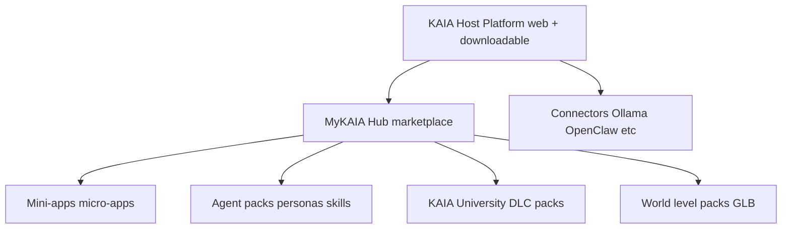
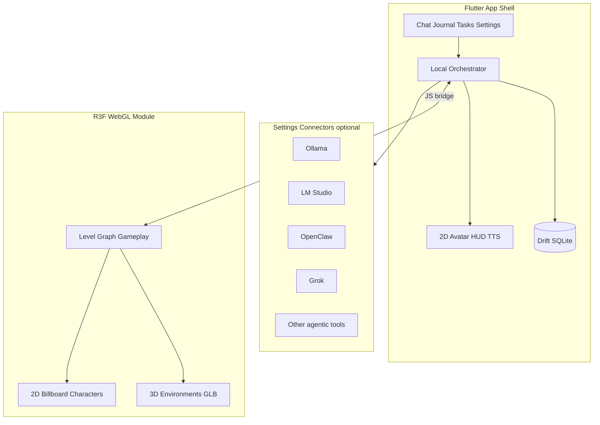

# MyKAIA Portfolio Audit and Consolidation Plan

## Current status

- **Not building the app yet.** Plan iteration only.
- **Brand locked:** **MyKAIA** — tagline **“Keep At It, Always”** (trademarked). Copyrights: **Mycelia Interactive**.
- **Engine locked:** Flutter (stable) for the application shell + **React Three Fiber / WebGL** for the game world.
- **Product locked as dual-layer:** neurodivergent multitool companion (journal, tasks, chat, settings) **and** game mechanics (levels, XP, 3D environments, 2D characters).
- **Connectors locked:** OpenClaw, Ollama, LM Studio, Grok, and other AI/agentic tools are **optional Settings → Connectors** — not hard runtime dependencies.
- **Distribution locked:** **mykaia.app** (paid) web + downloadable apps + planned **MyKAIA Hub** (in-platform mini-app / agent / pack marketplace).
- **Module Focus Mode locked:** every module has its own distraction-free fullscreen focus mode (see below).
- **Full document** (after deeper planning) → `D:\_Dev\docs\KAIA_(Keep_At_It_Always)\` + Google Drive folder `KAIA_(Keep_At_It_Always)`.

---

## Brand and IP (locked)

| Element | Locked value |
|---------|----------------|
| **Brand** | **MyKAIA** |
| **Tagline** | **Keep At It, Always** |
| **Trademark** | MyKAIA / “Keep At It, Always” — treat as trademarked; protect in all product, web, and store surfaces |
| **Copyright** | **Mycelia Interactive** (include on About, legal, docs, installers, web footers, pack manifests) |
| **Domain** | [mykaia.app](https://mykaia.app) |
| **Companion character** | KAIA (in-product NPC / live agent); brand umbrella remains MyKAIA |
| **Marketplace surface** | **MyKAIA Hub** (not “Ecosystem” in public copy) |
| **Legal line (draft)** | © Mycelia Interactive. MyKAIA and “Keep At It, Always” are trademarks of Mycelia Interactive. |

Public naming pattern: **MyKAIA** first; tagline always available; avoid leading with “Ecosystem” or “MultiTool” as the brand.

---

## Distribution: web + downloadable + in-platform ecosystem

Ship **host surfaces** and an **in-KAIA app ecosystem** from the same Flutter + R3F product family:

| Surface | What users get | Notes |
|---------|----------------|-------|
| **Web app** | Full browser KAIA at **mykaia.app** | Marketing + app entry; R3F/WebGL world native in-browser |
| **Downloadable apps** | Installable OS clients | Windows / macOS / Linux; iOS / Android stores or sideload as policy allows |
| **MyKAIA Hub (in-app)** | Discover / install / enable **mini-apps** inside MyKAIA | Platform marketplace pattern — not a separate OS store only |

### Industry terms (verified)

What you described is a well-established pattern. Common names:

| Term | Meaning | Examples |
|------|---------|----------|
| **App marketplace** / **app hub** / **ecosystem hub** | Catalog where users browse and install apps that extend a host product | Slack Marketplace, Shopify App Store, Salesforce AppExchange |
| **Platform ecosystem** / **ecosystem-native apps** | Third-party (or first-party) apps that live *inside* someone else’s platform | Notion integrations, Figma plugins, VS Code extensions |
| **Mini-apps** / **micro-apps** | Lightweight utilities that run *in* a host app (often sandboxed), not only as standalone downloads | WeChat / Alipay mini-apps; Western “super-app” / host-app model |
| **Integrations marketplace** | Often connector-heavy; overlaps but thinner than full mini-apps | Many SaaS “Integrations” directories |
| **Agent marketplace** / **agent exchange** (AI-era) | Installable agents, skills, tools, MCP servers inside an AI host | GPT Store / ChatGPT Apps, Claude apps/connectors, Salesforce AgentExchange, MCP directories |

**Marketplace naming (locked):** **MyKAIA Hub** — the in-product marketplace for installable mini-apps, agent packs, and University/content packs. Public storefront: **mykaia.app/hub** (or `/store` alias). Do not use “Ecosystem” in consumer-facing brand copy.

### How KAIA layers relate



- **Connectors** (Settings) = runtime/tool *wiring* (Ollama, OpenClaw, Calendar…) — always optional.  
- **Mini-apps** = richer installable *experiences* inside KAIA (UI + permissions + optional billing) — Bubble Popper–class rewards, specialized workflows, partner tools.  
- **University / World packs** = content DLC distributed through the same ecosystem catalog with different package kinds.  
- **Agent packs** = installable NPC/persona/skill bundles for the live companion layer.

### Hub marketplace capabilities (phased)

**Phase G+ / Platform tier (after companion + world core):**

- Catalog: search, categories, ratings, verified publisher badges  
- Install / uninstall / enable into the user workspace  
- Permissions manifest (what data/APIs the mini-app may touch)  
- Sandboxed runtime (prefer webview/WASM or constrained Flutter plugin API — finalize in full doc)  
- First-party mini-apps before third-party; security review pipeline before open ISV publish  
- Optional monetization later (free / paid / subscription / usage) — not required for v1 catalog  

Aligns with older KAIA Wrapper **Tier C** intent (mini-app store + builder) without building it before the host product exists.

### Domain

- **Locked domain: [mykaia.app](https://mykaia.app)** — purchased and paid **2026-07-27 ~2:52 PM** (Dynadot).
- Use the domain for MyKAIA Flutter web + marketing + download portal + Hub storefront (DNS to Cloudflare Pages / chosen host).
- Domain hosts:
  - Public marketing / landing
  - Full **web app**
  - Download portal for desktop/mobile installers
  - **MyKAIA Hub** catalog / developer docs (later)
  - Optional CDN for University DLC, world packs, and mini-app artifacts

### Web vs download roles

- **Web:** instant access, easiest path for the 3D world (WebGL), shareable University/content links, possible SaaS account layer later.
- **Downloadable:** deeper OS integration (tray/hotkeys, local file vaults, local Ollama/LM Studio connectors, offline-first SQLite), better for always-available capture and Live Audio Listen.

Feature parity goal: same modules on web and native where platform APIs allow; native may expose extra connectors/hotkeys that the browser cannot.

### Hosting sketch (finalize in full doc)

- Flutter web build + static marketing on the custom domain (Cloudflare Pages / similar).
- R3F world either same-origin static assets or embedded route.
- Desktop installers from GitHub Releases or the download portal; mobile via store pipelines when ready.
- Local-first default still applies; cloud sync/accounts only if SaaS phase ships.

---

## Locked architecture: Flutter + R3F hybrid

### Why this split

| Layer | Tech | Owns |
|-------|------|------|
| **App shell** | Flutter stable + Dart 3.x | Windows/macOS/Linux/iOS/Android UI, chat, journal, tasks, focus, settings, Drift/SQLite, TTS avatar HUD, connector config |
| **World / game** | React + **React Three Fiber** + Three.js (WebGL) | 3D environments, levels, camera, lights, collisions/triggers, collectibles, ambient progression spaces |
| **Characters** | **2D sprites / billboards** inside the R3F scene (+ Flutter HUD avatar for chat) | KAIA and other NPCs face camera; lip-sync/sprites; no full 3D body mesh required for v1 |
| **Bridge** | Flutter WebView (`webview_flutter` / InAppWebView) + JS channel | XP, level unlocks, quest state, enter cavern, tool results, rapport to world mood |



### Integration pattern

1. Build the world as a **Vite + React 19 + R3F 9** package (static export).
2. Bundle into Flutter assets or load from app documents for large packs.
3. Embed via WebView full-screen World route; companion UI stays in Flutter.
4. Bidirectional bridge: Flutter runs JS / postMessage; R3F posts to JavascriptChannel.

Do not run R3F inside Dart. Do not rebuild productivity UI in React.

---

## 3D assets — yes, with a clear split

**Include 3D for environments and props. Keep characters 2D.**

| Include in v1 | Defer |
|---------------|--------|
| Environment GLBs (hubs, rooms, level stages) | Full 3D character meshes/rigs |
| Props, interactables, artifact models | Photoreal / MetaHuman pipelines |
| Level lighting/fog/sky presets | Massive open-world streaming |
| Collision/trigger metadata beside each GLB | |
| 2D spritesheets for KAIA + user-created NPCs | |

Art direction: **2D cast on a 3D stage**. Pipeline: Blender → optimized GLB (Draco/meshopt) → world pack manifest → R3F loaders.

---

## Game mechanics (in scope)

- Levels / hubs unlocked by XP milestones and optional quests
- Non-punitive XP and artifacts (XP never decreases)
- Soft quests; fully hideable via Simple Mode
- World triggers that open Flutter tools (journal kiosk, task board, talk-to-KAIA)
- Rapport float affects ambient mood / lighting only
- Discrete levels / hubs (not an open MMO)

---

## Connectors module (Settings)

App runs with **no connectors** enabled. Everything below is opt-in.

### Shared connector record (`connector_configs`)

| Field | Type | Notes |
|-------|------|-------|
| `id` | UUID | PK |
| `connector_id` | string | Stable adapter key, e.g. `ollama`, `lm_studio`, `grok`, `openclaw` |
| `kind` | enum | `model_runtime` \| `agentic_tool` |
| `enabled` | bool | Default `false` |
| `display_name` | string | UI label |
| `endpoint_url` | string? | Base URL when applicable |
| `api_path_prefix` | string? | e.g. `/v1` |
| `auth_type` | enum | `none` \| `bearer` \| `api_key_header` \| `oauth` \| `custom` |
| `credentials_ref` | string? | OS keychain / secure storage ref — **never plaintext in DB** |
| `extra_headers_json` | object? | Non-secret headers only |
| `model_defaults_json` | object? | Default model ids, temp, max tokens |
| `health_json` | object? | Last probe: `{ ok, latency_ms, checked_at, message }` |
| `priority` | int | Orchestrator preference order among enabled model runtimes |
| `timeout_ms` | int | Default request timeout |
| `updated_at` | ISO-8601 | |

### Common UI fields (every connector card)

- Enable toggle  
- Test connection / health badge  
- Save / discard  
- “Clear credentials”  
- Optional notes field for the user  

### Model / runtime connectors — interface fields

#### `ollama` (local)

| Field | Default / example | Required |
|-------|-------------------|----------|
| `endpoint_url` | `http://127.0.0.1:11434` | yes when enabled |
| `api_path_prefix` | `` (native) or `/v1` if OpenAI-compat mode | no |
| `auth_type` | `none` | — |
| `credentials_ref` | unused | no |
| `default_chat_model` | e.g. `llama3.1:8b-instruct-q4_K_M` | recommended |
| `default_embed_model` | optional | no |
| `pull_hint` | UI copy: ensure `ollama serve` is running | — |
| `stream` | `true` | — |

#### `lm_studio` (local OpenAI-compatible)

| Field | Default / example | Required |
|-------|-------------------|----------|
| `endpoint_url` | `http://127.0.0.1:1234` | yes when enabled |
| `api_path_prefix` | `/v1` | yes |
| `auth_type` | `none` or `bearer` if user set a local key | — |
| `credentials_ref` | optional local key | no |
| `default_chat_model` | whatever LM Studio exposes | recommended |
| `compat_mode` | `openai` | yes |

#### `grok` / xAI (cloud)

| Field | Default / example | Required |
|-------|-------------------|----------|
| `endpoint_url` | xAI API base (pin in full doc) | yes when enabled |
| `api_path_prefix` | `/v1` | yes |
| `auth_type` | `bearer` | yes |
| `credentials_ref` | keychain ref for API key | **yes** when enabled |
| `default_chat_model` | e.g. latest Grok chat id | recommended |
| `default_image_model` | optional Imagine | no |

#### `openai_compatible` (generic)

| Field | Notes |
|-------|-------|
| `endpoint_url` | User-supplied base |
| `api_path_prefix` | usually `/v1` |
| `auth_type` | `bearer` / `api_key_header` |
| `credentials_ref` | keychain |
| `default_chat_model` | free text |
| `custom_header_name` | if `api_key_header` |

### Agentic / tool connectors — interface fields (all optional)

#### `openclaw`

| Field | Notes |
|-------|-------|
| `endpoint_url` | e.g. `ws://127.0.0.1:18789` or HTTP base — transport finalized in full doc |
| `transport` | `websocket` \| `http` |
| `auth_type` / `credentials_ref` | if the local OpenClaw instance requires a token |
| `route_models_through` | bool — when true, orchestrator may use OpenClaw as a router **only if enabled** |
| `health_probe` | ping/list models |

#### `cursor` / `zed`

| Field | Notes |
|-------|-------|
| `install_path` or `cli_path` | Detected or user-picked |
| `workspace_path` | Optional default project root |
| `account_profile` | e.g. mycelia vs student (from Wrapper doctrine) |
| `credentials_ref` | only if API/token needed |

#### `obsidian`

| Field | Notes |
|-------|-------|
| `vault_path` | Absolute path to vault |
| `api_port` / `endpoint_url` | If Local REST / similar |
| `credentials_ref` | API key if required |
| `default_folder` | Optional inbox folder for captures |

#### `google_calendar`

| Field | Notes |
|-------|-------|
| `auth_type` | `oauth` |
| `credentials_ref` | OAuth token bundle in keychain |
| `calendar_id` | Primary or selected |
| `sync_direction` | `pull` \| `push` \| `bidirectional` |
| `sync_window_days` | int |

#### `blender_mcp` / `unreal` (later)

| Field | Notes |
|-------|-------|
| `endpoint_url` | e.g. Blender MCP `localhost:9876` |
| `project_path` / `engine_path` | Unreal |
| `credentials_ref` | if any |
| `enabled` | off by default |

### Orchestrator selection rules

1. No model connector enabled → local heuristics / offline fallback replies only (honest UI).  
2. One or more model runtimes enabled → pick by `priority`, skip unhealthy.  
3. OpenClaw never required; if enabled with `route_models_through`, it sits in front of other runtimes.  
4. Tool connectors are invoked only when a tool call names them or the user opens that integration.

---

## First three levels (World v1)

Art direction: calm koi/pond / cavern-adjacent fantasy (from Wrapper + ChronoXP), **2D KAIA billboard** in **3D GLB** spaces. Non-punitive unlocks.

### Level 0 — `hub_home` (always unlocked)

| | |
|--|--|
| **Role** | Safe home hub; orientation; portals to later levels |
| **GLB pack** | `world/hub_home/hub_home.glb` + lighting preset `hub_dusk_pond` |
| **Spawn** | `spawn_arrival_dock` |
| **NPCs** | `kaia` billboard at `spawn_kaia_lily` (idle/wave/talk) |
| **Interactables** | Journal kiosk → `app.open_journal`; Task board → `app.open_task`; Chat stone → `app.npc_interact` kaia; Portal frames (locked silhouettes until unlock) |
| **Areas** | `area_dock`, `area_kaia_nook`, `area_portal_row` |
| **Artifacts** | `artifact_starter_lily` (auto-grant or soft pickup on first visit) |
| **Quests** | `quest_welcome_breath` — optional: talk to KAIA once + open journal once (skippable) |
| **XP** | Small welcome XP on first hub enter + quest objectives via `app.xp_request` |
| **Unlocks from here** | Portal to `level_01_pond` unlocked at account create / first launch |

### Level 1 — `level_01_pond` (first playable)

| | |
|--|--|
| **Role** | First explorable space; teach bridge interactions + Module Focus entry from world |
| **GLB pack** | `world/level_01_pond/level_01_pond.glb` |
| **Unlock rule** | Always available after onboarding completes (`onboarding_state.completed`); no XP gate |
| **Spawn** | `spawn_shore` |
| **NPCs** | KAIA near shore; optional silent ambient critter billboards (no dialogue) |
| **Triggers** | Shore walk → soft VO hint; Kiosk “Capture” → `app.quick_capture`; Focus lantern → `app.enter_module_focus` journal or timed focus |
| **Areas** | `area_shore`, `area_bridge`, `area_reed_path` |
| **Artifact** | `artifact_pond_pebble` — collect at reed path end |
| **Quest** | `quest_first_shore` — visit three areas + collect pebble (optional) |
| **XP** | Area first-visits + artifact + quest complete |
| **Unlocks** | Completing `quest_first_shore` **or** reaching XP threshold `xp >= level_defs[2].xp_required` unlocks portal to `level_02_records_antechamber` |

### Level 2 — `level_02_records_antechamber` (progression fantasy)

| | |
|--|--|
| **Role** | ChronoXP “Records Cavern” antechamber — reward space for consistency, not grind shame |
| **GLB pack** | `world/level_02_records_antechamber/level_02_records_antechamber.glb` |
| **Unlock rule** | `unlocks` contains `level_02_records_antechamber` after Level 1 quest **or** XP gate (whichever first); Simple Mode users can unlock via XP without entering world |
| **Spawn** | `spawn_antechamber_gate` |
| **NPCs** | KAIA as guide near pedestal; empty plinths for future user NPCs |
| **Interactables** | Pedestal gallery shows earned `artifacts`; University door (if pack installed) → `app.open_university`; Locked inner door to future `level_03_*` |
| **Areas** | `area_gate`, `area_gallery`, `area_pedestal`, `area_university_alcove` |
| **Artifact** | `artifact_records_seal` — granted on first enter |
| **Quest** | `quest_place_pebble` — “place” pond pebble on pedestal (inventory → display); optional journal reflection prompt |
| **XP** | First enter bonus + pedestal place + reflection |
| **Unlocks** | Sets flag for future Level 3; may raise `user_progression.level` cosmetic tier |

### Unlock / XP wiring (app-authoritative)

```text
hub_home                    → always
level_01_pond               → onboarding complete
level_02_records_antechamber → quest_first_shore complete OR xp >= L2 threshold
```

World sends `app.unlock_request` / `app.collect_artifact` / `app.xp_request`; app validates and emits `world.unlock_area` / `world.grant_artifact` / `world.set_xp`.

### World pack manifest snippet (draft)

```json
{
  "pack_id": "kaia_world_v1",
  "levels": [
    {
      "level_id": "hub_home",
      "glb": "hub_home/hub_home.glb",
      "spawn_id": "spawn_arrival_dock",
      "always_unlocked": true
    },
    {
      "level_id": "level_01_pond",
      "glb": "level_01_pond/level_01_pond.glb",
      "spawn_id": "spawn_shore",
      "requires": ["onboarding_complete"]
    },
    {
      "level_id": "level_02_records_antechamber",
      "glb": "level_02_records_antechamber/level_02_records_antechamber.glb",
      "spawn_id": "spawn_antechamber_gate",
      "requires_any": ["quest:quest_first_shore", "xp_level:2"]
    }
  ]
}
```

---

## Stack pins (to finalize in full doc)

**Flutter shell:** Flutter stable + Dart 3.x, Riverpod, go_router, Drift/SQLite, WebView host, TTS + HUD sprites.

**World package:** React 19, Vite, TypeScript, R3F 9, drei, Three.js, GLB envs, 2D billboards.

**Source of truth:** Flutter/SQLite for XP, unlocks, journal, tasks, NPC defs. World is view + interaction surface.

---

## Live agents

- KAIA and user-created NPCs use live conversational sessions with persona prompts and injected session state (rapport, mood, app context).
- Split: **KAIA/NPCs speak**; a silent **orchestrator** runs tools (journal, tasks, focus, world commands).
- Real-time hear-and-respond; barge-in supported with interrupt throttling and session reconnect.
- **Live Audio Listen** is opt-in (onboarding + settings): immersive continuous listen so the user can talk freely without pressing buttons or typing.
- Rapport state can influence NPC tone and world ambient mood.

---

## Neurodivergent UX

Full-spectrum ND UX (not ADHD-only). Every cognitive/sensory accessibility control is toggleable in Settings and customizable in Onboarding. Live Audio Listen is an explicit onboarding choice.

---

## Module Focus Mode (every module)

**Rule:** every module (Chat, Journal, Notepad, Tasks, Routines, NPC Studio, KAIA University, World, Create, Design, Progression, etc.) ships its own **Focus Mode**.

### Behavior

- Fullscreen (or equivalent immersive surface) with **zero chrome from other modules** — no sidebar drawers, no other module panels, no ambient shell clutter.
- Easy **shrink / close** of the focus layer without losing module state (exit returns to shell with that module still available).
- Distinct from optional **timed Focus Session** tools (pomodoro-style); Module Focus Mode = UI immersion for the active module.

### Exit affordance (default: top-right)

| Property | Spec |
|----------|------|
| Default corner | **Top-right** of the screen |
| Enter focus | Module control + optional shortcut (settings) |
| Exit control copy | “Click here to exit Focus Mode” (tap-friendly on mobile) |
| Initial visibility | Exit control **visible for 10 seconds** on enter |
| Then | Becomes **invisible** but the hit zone remains |
| Reveal again | **Pointer enter / mouse-over** of the zone, or **tap/click** in the zone |
| Re-hide | After reveal, **10-second timer** then invisible again |
| Keyboard | Dedicated shortcut exits Focus Mode (works even when control is invisible) |
| Customize | **Settings → Keybindings** (or Focus): customize “Exit Focus Mode” shortcut; optional later: corner position |

### Implementation notes (for full doc)

- Shared `ModuleFocusScaffold` wrapper used by all modules so behavior is identical.
- Invisible state = opacity 0 / ignore pointer on label only; keep a minimum hit target (e.g. 44×44+ dp) in the corner zone.
- Respect ND motion/reduced-flash prefs; no aggressive pulsing on the exit control.
- World (R3F) Focus Mode still uses the same Flutter overlay chrome for exit (bridge may pause world HUD).

### Settings keys (draft)

- `focus_mode.exit_shortcut` — user-customizable
- `focus_mode.exit_corner` — default `top_right`
- `focus_mode.chrome_visible_ms` — default `10000`
- `focus_mode.reveal_hide_ms` — default `10000`

---

## Module map

### Flutter
- Chat / KAIA live companion
- NPC Studio (hours-long creation loop)
- Journal (locked) + open Notepad
- Tasks / Time sessions
- Routines / Automations / Reminders
- **KAIA University** (education module / DLC layer)
- Create (novel/screenplay — phased)
- Design scratchpad (phased)
- World host (WebView)
- Progression (XP, levels, artifacts)
- Settings (ND UX, Voice, Connectors, Focus Mode keybindings)
- Onboarding
- **Per-module Focus Mode** via shared scaffold (all modules above)

### KAIA University

Education is its own module and **DLC-style content layer**, not a fixed built-in course pack.

- **Module:** in-app University hub (tracks, lessons, progress, certificates/milestones as designed later)
- **DLC layer:** learning packs can ship and update independently of the core app binary (remote or side-loaded content manifests)
- **Living curriculum:** official materials can be refreshed continuously without waiting on a full app release
- **User / community imports:** users can bring **open-source learning materials** into the KAIA ecosystem (import pack format TBD in full doc — e.g. markdown/scorm-like/zip manifest with license metadata)
- **ND-friendly delivery:** chunked lessons, optional Live Audio Listen tutoring via KAIA, sensory/cognitive toggles respected
- **Optional world hooks:** University portals/kiosks in R3F hubs can deep-link into a track (`app.open_university`)

Pack model (draft): `university_packs` with `pack_id`, `version`, `source` (`official` | `user_import` | `community`), `license`, `manifest_url` / local path, `enabled`.

### R3F world
- Hub
- Level runtime (GLB + triggers + NPC billboards)
- Progression visuals
- Interaction bus → bridge events
- Optional University portal zones

---

## Bridge event contract (deepened)

### Design rules

- **Source of truth:** Flutter / Drift SQLite owns XP, unlocks, quests, NPC defs, journal/tasks. World is a view + interaction surface.
- **Transport:** Flutter WebView ↔ R3F via named JS channel `KaiaBridge` (JSON text payloads only).
- **Envelope:** every message uses the same wrapper; world never invents progression math.
- **Bridge scope:** app context, progression, NPC/world interaction, and user intent only.

- **Simple Mode:** when on, Flutter does not mount World WebView; bridge is idle.

### Envelope schema

```json
{
  "v": 1,
  "id": "uuid",
  "ts": "ISO-8601",
  "dir": "app_to_world | world_to_app",
  "type": "event.type.name",
  "payload": {},
  "ack_of": null
}
```

- `id`: unique per message (dedupe)
- `ack_of`: set on `bridge.ack` / `bridge.nack` only
- Unknown `type` → `bridge.nack` with `code: unknown_type` (do not crash scene)

### Lifecycle / sync events

| Type | Dir | Payload | Notes |
|------|-----|---------|-------|
| `bridge.hello` | world→app | `{ world_build, r3f_version }` | World ready; app replies with snapshot |
| `bridge.hello_ack` | app→world | `{ app_build, schema_v }` | Confirms protocol version |
| `world.request_snapshot` | world→app | `{}` | After reconnect / tab resume |
| `world.snapshot` | app→world | see Snapshot below | Full authoritative state |
| `bridge.ack` | either | `{ ok: true }` | Optional for mutating events |
| `bridge.nack` | either | `{ code, message }` | Validation / unknown type |
| `bridge.ping` / `bridge.pong` | either | `{ t }` | Health; app may remount WebView on timeout |

### Snapshot (authoritative boot state)

`world.snapshot` payload:

```json
{
  "simple_mode": false,
  "xp": 0,
  "level": 1,
  "rapport": 0.5,
  "mood": "calm",
  "current_hub": "hub_home",
  "current_level": null,
  "unlocks": ["hub_home", "level_01_pond"],
  "artifacts": ["artifact_starter_lily"],
  "npcs": [
    {
      "npc_id": "kaia",
      "display_name": "KAIA",
      "sprite_pack": "kaia_default",
      "rapport": 0.5,
      "active": true
    }
  ],
  "quests_active": [],
  "settings_visual": {
    "motion_intensity": "medium",
    "reduced_flash": true
  }
}
```

World applies snapshot idempotently (replace local caches; do not merge conflicting XP).

---

### App → World events (Flutter commands the view)

#### Progression

| Type | Payload | World behavior |
|------|---------|----------------|
| `world.set_xp` | `{ xp: number }` | Update HUD/meters; may play soft FX if delta > 0 |
| `world.set_level` | `{ level: number }` | Refresh level badge; does not auto-travel |
| `world.unlock_area` | `{ area_id: string, reason?: string }` | Open portal/door; mark walkable |
| `world.lock_area` | `{ area_id: string }` | Rare admin/debug; hide portal |
| `world.grant_artifact` | `{ artifact_id: string }` | Spawn/show collectible showcase |
| `world.revoke_artifact` | `{ artifact_id: string }` | Debug/support only |

#### Navigation / scene

| Type | Payload | World behavior |
|------|---------|----------------|
| `world.load_hub` | `{ hub_id: string }` | Load hub GLB + default spawn |
| `world.load_level` | `{ level_id: string, spawn_id?: string }` | Load level pack; place player/camera |
| `world.travel_to` | `{ target_id: string, transition?: "fade"|"walk" }` | Animated move to portal/marker |
| `world.set_camera` | `{ preset: string }` \| `{ pos, look_at }` | Cinematic or accessibility framing |
| `world.pause` | `{ paused: boolean }` | Freeze anim/input; audio duck optional |

#### KAIA / NPC presence

| Type | Payload | World behavior |
|------|---------|----------------|
| `world.spawn_npc` | `{ npc_id, spawn_id?, sprite_pack?, visible? }` | Place 2D billboard |
| `world.despawn_npc` | `{ npc_id }` | Remove billboard |
| `world.focus_npc` | `{ npc_id, duration_ms? }` | Camera ease to NPC |
| `world.set_npc_state` | `{ npc_id, anim: "idle"|"talk"|"wave"|"listen", emote? }` | Drive sprite sheet |
| `world.kaia_speak_viseme` | `{ npc_id: "kaia", viseme: string, t: number }` | Lip-sync while Flutter TTS plays |
| `world.kaia_speak_end` | `{ npc_id: "kaia" }` | Return to idle/listen |

#### Rapport / ND visual prefs

| Type | Payload | World behavior |
|------|---------|----------------|
| `world.set_rapport` | `{ rapport: number }` | 0.0–1.0; tint ambient / NPC warmth |
| `world.set_mood` | `{ mood: string }` | e.g. calm, focused, tired, overwhelmed — lighting/fog only |
| `world.set_simple_mode` | `{ enabled: boolean }` | If true mid-session, world should idle/unload |
| `world.set_visual_prefs` | `{ motion_intensity, reduced_flash, color_filter? }` | Respect ND toggles from Settings |

#### Quests (display only; completion reported by world)

| Type | Payload | World behavior |
|------|---------|----------------|
| `world.quest_offer` | `{ quest_id, title, objective_ids[] }` | Show markers |
| `world.quest_update` | `{ quest_id, progress }` | Update markers |
| `world.quest_clear` | `{ quest_id }` | Remove markers |

---

### World → App events (Flutter executes tools / persists)

#### Navigation / presence

| Type | Payload | App behavior |
|------|---------|--------------|
| `app.world_ready` | `{ hub_id?, level_id? }` | Same as hello path if late |
| `app.level_entered` | `{ level_id, spawn_id? }` | Persist `world_state`; analytics optional |
| `app.level_exited` | `{ level_id, to_hub_id? }` | Persist location |
| `app.portal_used` | `{ from_id, to_id }` | May trigger `world.load_*` after checks |

#### Open Flutter surfaces (capture-before-organize)

| Type | Payload | App behavior |
|------|---------|--------------|
| `app.open_chat` | `{ npc_id?, preset_prompt? }` | Open chat; optional focus NPC |
| `app.open_journal` | `{ mode: "locked"|"notepad", template_id? }` | Open journal composer |
| `app.open_task` | `{ task_id?, action?: "clock_in"|"view" }` | Open tasks / start session |
| `app.open_timed_focus` | `{ duration_min? }` | Timed focus session tool (not Module Focus Mode) |
| `app.enter_module_focus` | `{ module_id }` | Enter that module’s distraction-free Focus Mode |
| `app.exit_module_focus` | `{}` | Exit Focus Mode (same as corner control / shortcut) |
| `app.open_npc_studio` | `{ npc_id? }` | Create/edit NPC |
| `app.open_university` | `{ pack_id?, track_id?, lesson_id? }` | Open KAIA University |
| `app.open_settings` | `{ section?: "connectors"|"accessibility"|"voice" }` | Deep-link settings |
| `app.quick_capture` | `{ source: "world_kiosk", text_seed? }` | PocketJournal-style jot |

#### Progression reports (app validates + persists)

| Type | Payload | App behavior |
|------|---------|--------------|
| `app.collect_artifact` | `{ artifact_id, level_id }` | If unlocked rules pass → grant + `world.grant_artifact` echo |
| `app.quest_objective_hit` | `{ quest_id, objective_id }` | Update quest; may award XP |
| `app.quest_complete` | `{ quest_id }` | Complete; award; clear world markers |
| `app.xp_request` | `{ amount, reason, source_event_id }` | App applies formula; emits `world.set_xp` (world does not self-award) |
| `app.unlock_request` | `{ area_id, reason }` | App checks level/XP; emits `world.unlock_area` or nack |

#### NPC interaction

| Type | Payload | App behavior |
|------|---------|--------------|
| `app.npc_interact` | `{ npc_id, interaction: "talk"|"inspect"|"gift" }` | Start live agent session or inspect sheet |
| `app.kaia_prompt` | `{ text?, from_zone? }` | Route to KAIA persona; may start Live Audio Listen if enabled |
| `app.npc_created_preview` | `{ temp_id }` | NPC Studio preview in world (phase E) |

#### Safety / UX

| Type | Payload | App behavior |
|------|---------|--------------|
| `app.escape_hatch` | `{ reason: "sensory"|"overwhelm"|"user" }` | Exit world → calm Flutter surface; pause world |
| `app.performance_degrade` | `{ fps, hint }` | App may lower `motion_intensity` or switch quality preset |
| `app.world_error` | `{ code, message }` | Toast + log; optional remount WebView |

---

### Ordering, ack, and failure rules

1. **Mutating world commands** from app (`unlock_area`, `load_level`, `grant_artifact`, `spawn_npc`) should receive `bridge.ack` / `bridge.nack` within 2s or app retries once with same `id`.
2. **XP and unlocks** always app-authoritative: world sends `*_request`; app confirms with `world.set_*` / `world.unlock_*`.
3. **Replay safety:** receivers ignore duplicate `id` for 60s.
4. **Reconnect:** on WebView remount, world sends `bridge.hello` → app sends `world.snapshot` (no delta sync in v1).
5. **Simple Mode mid-flight:** app sends `world.set_simple_mode` then unmounts WebView; in-flight world events dropped.
6. **ND prefs:** flash/motion-heavy FX gated by `world.set_visual_prefs`; world must honor `reduced_flash`.

### Example sequences

**Enter world from Flutter**

```text
app mounts WebView
world→app  bridge.hello
app→world  bridge.hello_ack
app→world  world.snapshot
app→world  world.load_hub { hub_id: "hub_home" }
world→app  app.level_entered { level_id: "hub_home" }
```

**Talk to KAIA billboard**

```text
world→app  app.npc_interact { npc_id: "kaia", interaction: "talk" }
app        starts/resumes KAIA live session
app→world  world.focus_npc { npc_id: "kaia" }
app→world  world.set_npc_state { npc_id: "kaia", anim: "talk" }
app→world  world.kaia_speak_viseme ... (while TTS)
app→world  world.kaia_speak_end
app→world  world.set_npc_state { npc_id: "kaia", anim: "idle" }
```

**Collect artifact**

```text
world→app  app.collect_artifact { artifact_id, level_id }
app        validates unlock rules, persists, awards XP
app→world  world.grant_artifact { artifact_id }
app→world  world.set_xp { xp }
```

**Journal kiosk in level**

```text
world→app  app.open_journal { mode: "notepad" }
app        opens composer (capture-first)
app        on save may world.quest_objective_hit via app logic
```

---

### ID conventions

- `hub_*` — hub spaces (e.g. `hub_home`)
- `level_##_*` — playable levels (e.g. `level_01_pond`)
- `area_*` — unlockable subregions inside a level
- `artifact_*` — collectibles
- `quest_*` / `objective_*` — quest graph
- `npc_*` — characters (`npc_id: "kaia"` reserved)
- `spawn_*` — spawn markers inside GLB metadata

---

### Minimal v1 event set (ship subset first)

Must implement before broader catalog:

- Lifecycle: `bridge.hello`, `bridge.hello_ack`, `world.snapshot`, `world.request_snapshot`
- Nav: `world.load_hub`, `world.load_level`, `app.level_entered`, `app.level_exited`
- Progression: `world.set_xp`, `world.unlock_area`, `app.xp_request`, `app.collect_artifact`
- NPC: `world.spawn_npc`, `world.set_npc_state`, `app.npc_interact`, `app.open_chat`
- Safety: `app.escape_hatch`, `world.set_visual_prefs`, `world.set_simple_mode`

---

## Data model (draft core)

- chats, messages
- journal_entries (locked vs notepad), tags
- tasks, task_sessions
- routines, automations, reminders
- npcs (persona, voice, sprite, rapport)
- user_progression, xp_events, level_defs, artifacts
- world_state (hub/level, unlocks)
- connector_configs (id, enabled, endpoint, credentials_ref)
- settings, onboarding_state, ND UX override JSON
- university_packs, university_tracks, university_lessons, university_progress (DLC / importable)
- creative_projects (phased)

---

## Phased roadmap (plan order — not build yet)

- **A** Companion core (Flutter shell, SQLite, chat, journal, tasks, ND toggles, onboarding, Live Audio Listen, **Module Focus Mode scaffold**)
- **B** Connectors (Ollama, LM Studio, OpenAI-compatible, Grok, OpenClaw, Calendar/Obsidian — all optional)
- **C** Live KAIA agent (persona, rapport, TTS HUD, barge-in, tools)
- **D** World v1 (R3F `hub_home` + `level_01_pond` + `level_02_records_antechamber`, GLB envs, 2D billboards, bridge, XP unlocks)
- **E** Web on **mykaia.app** + download portal (DNS, landing, web app deploy, installer links)
- **F** Creation depth (NPC Studio, KAIA University DLC/imports, novel/screenplay, automations)
- **G** Optional SaaS (accounts/sync/billing after local + web product are solid)
- **H** MyKAIA Hub v1 (catalog + first-party mini-apps + pack install; third-party ISV later)

---

## Doc deliverable outline (later write)

1. Vision, positioning, **brand & IP** (MyKAIA / Keep At It, Always / Mycelia Interactive)
2. ND UX principles
3. Locked stack (Flutter + R3F) and rationale
4. System architecture and bridge contract
5. Feature modules (incl. KAIA University as DLC/import layer)
6. Game design (levels, XP, 2D-in-3D, asset pipeline)
7. Live agent design (KAIA companion + user NPCs)
8. Connectors catalog
9. Data model
10. Onboarding + Live Audio Listen
11. Module Focus Mode (per-module fullscreen, exit chrome, shortcuts)
12. KAIA University pack format, licensing, update/import pipeline
13. Distribution (**mykaia.app**, web app, downloadable desktop/mobile)
14. **MyKAIA Hub** (app marketplace / mini-apps / agent packs — phased store)
15. Privacy / offline / possible SaaS
16. Phased delivery + acceptance
17. Donor project map
18. Legal: trademark + Mycelia Interactive copyright notices

---

## Immediate next deepen pass

Bridge events, first three levels, and connector interface fields are deepened.

Ready to write the full document to `D:\_Dev\docs\KAIA_(Keep_At_It_Always)\` and Google Drive `KAIA_(Keep_At_It_Always)` when you say go — or name another area to deepen first.
